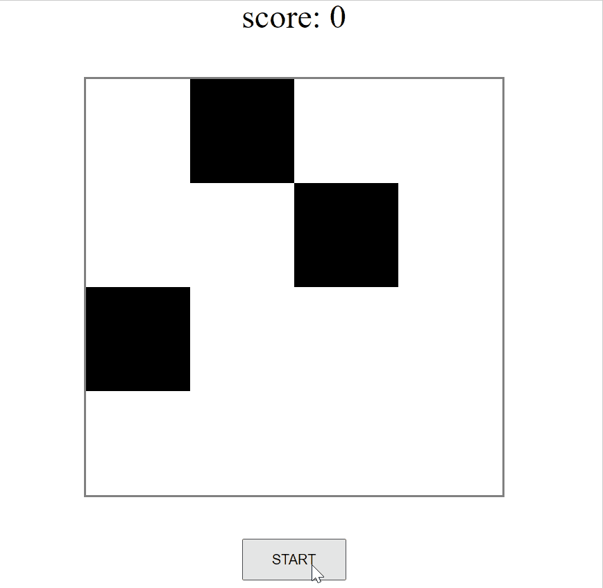
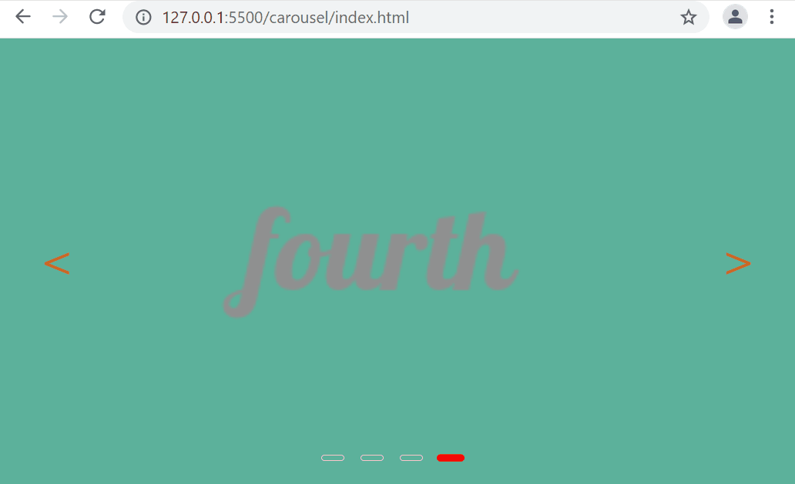
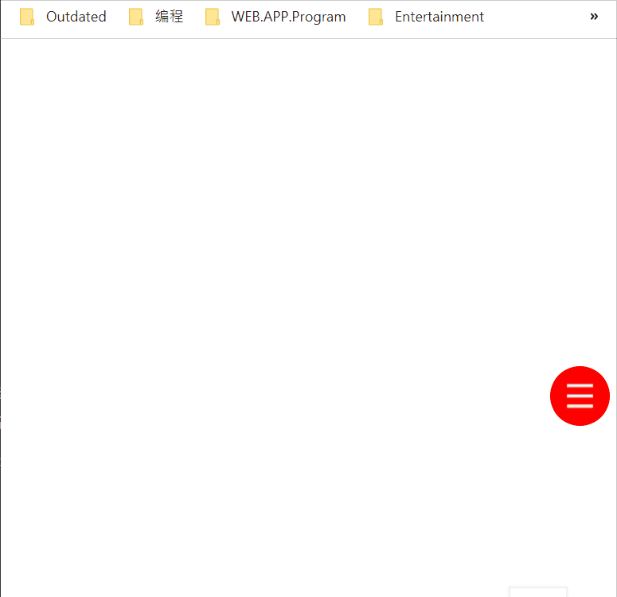

# Overview

A set of simple web pages for demostrating how to use html/css/js without using any external dependencies.

Application list:
- [x] [Animated loading](loading-animation/README.md)
- [x] [Animated cards](animated-card/README.md)
- [x] [Step on the black blocks](step-on-black/README.md)
- [x] [Carousel](carousel/README.md)
- [x] [YouTube clone](clone-youtube/README.md)
- [x] [Float action button](float-action-button/README.md)
- [ ] more will come soon

# Some Demos

- [Animated loading](loading-animation/README.md)

  

- [Animated cards](animated-card/README.md) 
  
  

- [step on the black blocks](step-on-black/README.md)
  
  

- [carousel](carousel/README.md)

  

- [YouTube clone](clone-youtube/README.md)

  

- [Float action button](float-action-button/README.md)

  
