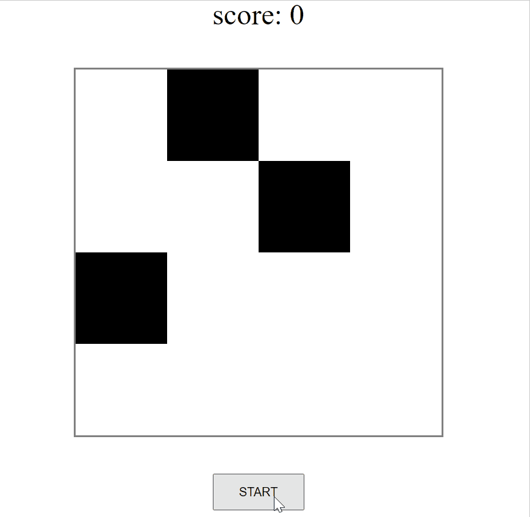

# Overview

A simple web application for practising basic knowledge of the frontend , i.e. html, javascript and css.

This application is adapted from [this](https://www.zhihu.com/question/38269966/answer/426707893). Thanks to the author of this article.

# Demo
<!--  -->

# Next step you can go further
- [ ] Make the speed variable: the more you score, the more quickly the blocks move.
